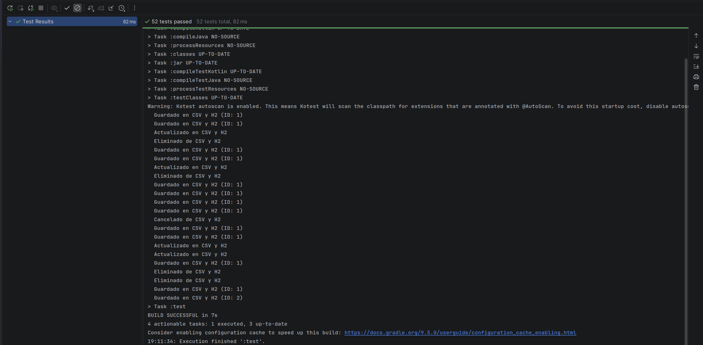
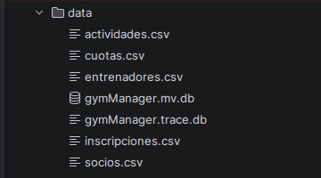
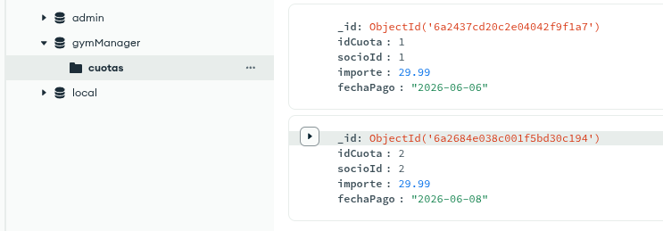
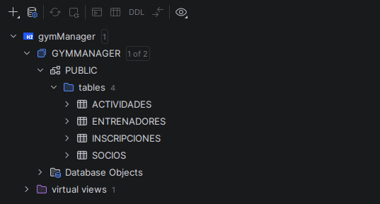

# Solución del proyecto

- **Proyecto:** <!-- Nombre del proyecto --> GymManager
- **Alumno/a:** <!-- Nombre y apellidos --> Jesús Gallardo Domínguez
- **Repositorio:** <!-- URL del repositorio --> [repo](https://github.com/IES-Rafael-Alberti/2526-u8u9-9-1-proyectolibre-Jesusgallardooo)

## 1. Resumen del proyecto

- **Problema que resuelve:** <!-- Explicación breve --> Mi proyecto resuelve el problema de gestionar la información y los 
datos de un gimnasio (socios, actividades, entrenadores, inscripciones y cuotas).


- **Usuarios principales:** <!-- A quién va dirigido --> Va dirigido a la administración de gimnasios que necesiten gestionar
datos digitalmente para poder consultar cualquier duda más fácilmente.


- **Funcionalidades principales:** <!-- Lista breve -->

  - CRUD para entidades principales (csv, mongo y h2)
  
  - Gestión de inscripciones con requisitos (socio activo/inactivo, socios sin repetir, plazas disponibles para actividades... )
  
  - Validación de datos regex
  
  - Manejo de excepciones
  
  - Menú interactivo por consola


- **Entidades principales:** <!-- Clases o conceptos del dominio -->
  - Socios
  - Entrenadores
  - Actividades
  - Cuotas
  - Inscripciones

- **Estructura del proyecto:** <!-- Paquetes principales y responsabilidad -->

## Estructura del proyecto

```text
src/main/
├── kotlin/
│   ├── app/
│   │   └── Main.kt                     # Punto de entrada
│   ├── exception/                      # Excepciones personalizadas
│   │   ├── NotFoundException.kt
│   │   ├── ValidationException.kt
│   │   ├── SocioNotFoundException.kt
│   │   ├── ActividadNotFoundException.kt
│   │   ├── EntrenadorNotFoundException.kt
│   │   ├── InscripcionNotFoundException.kt
│   │   ├── CuotaNotFoundException.kt
│   │   ├── SocioInactivoException.kt
│   │   ├── ActividadSinPlazasException.kt
│   │   └── SocioYaInscritoException.kt
│   ├── model/                          # Entidades del dominio
│   │   ├── Socio.kt
│   │   ├── Actividad.kt
│   │   ├── Entrenador.kt
│   │   ├── Inscripcion.kt
│   │   └── Cuota.kt
│   ├── repository/                     # Capa de acceso a datos
│   │   ├── Repository.kt              # Interfaz genérica
│   │   ├── file/                      # Repositorios CSV
│   │   │   ├── SocioCsvRepository.kt
│   │   │   ├── ActividadCsvRepository.kt
│   │   │   ├── EntrenadorCsvRepository.kt
│   │   │   ├── InscripcionCsvRepository.kt
│   │   │   └── CuotaCsvRepository.kt
│   │   ├── sql/                       # Repositorios H2 (socios, actividades, entrenadores, inscripciones)
│   │   │   ├── SqlSocioRepository.kt
│   │   │   ├── SqlActividadRepository.kt
│   │   │   ├── SqlEntrenadorRepository.kt
│   │   │   └── SqlInscripcionRepository.kt
│   │   └── mongo/                     # Repositorio MongoDB (solo cuotas)
│   │       └── MongoCuotaRepository.kt
│   ├── service/                        # Lógica de negocio
│   │   ├── SocioService.kt
│   │   ├── ActividadService.kt
│   │   ├── EntrenadorService.kt
│   │   ├── InscripcionService.kt
│   │   └── CuotaService.kt
│   ├── ui/                             # Interfaz de usuario
│   │   └── ConsolaUI.kt
│   ├── util/                           # Utilidades y gestores de conexión
│   │   ├── DatabaseManager.kt          # Gestión de conexión H2
│   │   └── MongodbManager.kt           # Gestión de conexión MongoDB
│   └── validator/                      # Validadores de datos
│       ├── SocioValidator.kt
│       ├── ActividadValidator.kt
│       ├── EntrenadorValidator.kt
│       ├── CuotaValidator.kt
│       └── InscripcionValidator.kt
└── resources/                          # Archivos de configuración
    └── simplelogger.properties         # Configuración para silenciar logs de MongoDB
```

- **Requisitos previos:** <!-- JDK, MongoDB, SGBD, variables de entorno -->
  - JDK 21 o superior
  - MongoDB atlas
  - H2
  - Variables de entornos definidas en el `.env`
- **Configuración necesaria:** <!-- Ficheros, puertos, datos de prueba -->
  - Archivo `.env` con las variables de entorno
  - Las tablas en H2 se crean automáticamente al arrancar (DatabaseManager.initDataBase)
  - Los ficheros se crean en `data/` la primera vez que se escribe.
- **Datos de prueba incluidos:** <!-- Dónde están y cómo se usan -->
  - En `data/` están los ficheros:
    - socios.csv
    - actividades.csv
    - entrenadores.csv
    - cuotas.csv
    - inscripciones.csv
  - los datos de H2 (`gymManager.mv.db`)
  - Los datos que hay de mis pruebas se cargan automáticamente

## 3. Diseño y modelo

- **Clases principales:** <!-- Clase -> responsabilidad -->
  - Socio: datos del socio 
  - Entrenador: entrenador del gimnasio
  - Actividad: actividad del gimnasio
  - Inscripción: vincula un socio a una actividad
  - Cuota: pagos de los socios.

- **Relaciones importantes:** <!-- Herencia, interfaces, composición -->

  - Interfaz genérica `Repository<T, ID>` implementada en toda la capa repository. Los servicios dependen de esta interfaz
  no de las implementaciones concretas.
  
  - Herencia de excepciones: `NotFoundException` (open) -> `SocioNotFoundException`, `ActividadNotFoundException` con cada entidad... 
  
  - Composición: los servicios reciben sus repositorios por constructor (`SocioService(csvRepo, sqlRepo)`)

  - Polimorfismo: SocioService puede utilizarse con cualquier implementación de `Repository<Socio, Long>`

- **Genéricos usados:** <!-- Clase/interfaz/función y motivo -->
    
    - `Repository<T, ID>`: interfaz genérica que me permite definir métodos CRUD para las entidades principales sin repetir
    código. `T` es el tipo de entidad e `ID` es el tipo de su identificador (siempre es de tipo `Long`).
  

- **Colecciones usadas:** <!-- Tipo, uso y justificación -->

  - MutableMap<Long, T>: en repositorios CSV (5 clases). Almacena entidades en memoria con clave = ID. 
  Justificación: acceso O(1) por ID, evita duplicados, facilita actualización/eliminación.

  - MutableList<T>: en repositorios SQL y MongoDB para construir listas desde ResultSet o FindIterable. También en escritura
    de CSV para armar líneas. Es ordenada y eficiente para añadir al final.
  
  - List<T>: retornada por findAll(). Inmutable, mantiene orden (sortedBy { it.id }).


- **Principios SOLID aplicados:** <!-- Al menos dos, con enlace al código -->

  - Single Responsibility(S): Cada clase tiene una única responsabilidad
    - `SocioValidator`: valida datos [(enlace)](https://github.com/IES-Rafael-Alberti/2526-u8u9-9-1-proyectolibre-Jesusgallardooo/blob/69def15af6aba7e0c1e3c790f61d08c783ef2abc/src/main/kotlin/validator/SocioValidator.kt#L8-L32)
    - `SocioService`: contiene lógica de negocio [(enlace)](https://github.com/IES-Rafael-Alberti/2526-u8u9-9-1-proyectolibre-Jesusgallardooo/blob/69def15af6aba7e0c1e3c790f61d08c783ef2abc/src/main/kotlin/service/SocioService.kt#L12-L51)
    - `ConsolaUI`: interactúa con el usuario [(enlace)](./src/main/kotlin/ui/ConsolaUI.kt)

  - Open / Closed (O): la interfaz `Repository<T, ID>` está cerrada a modificaciones pero abierta a extensiones, posibilitando
  añadir nuevas implementaciones. También `NotFoundException` es una clase abierta que se extiende en cada tipo concreto de
  excepción por herencia. [(enlace)](https://github.com/IES-Rafael-Alberti/2526-u8u9-9-1-proyectolibre-Jesusgallardooo/blob/69def15af6aba7e0c1e3c790f61d08c783ef2abc/src/main/kotlin/repository/Repository.kt#L3-L14)
  
  - Liskov Substitution(L): cualquier implementación de la interfaz `Repository<T, ID>` puede sustituir a otra sin modificar
  el comportamiento esperado. Por ejemplo, `SocioService` acepta cualquier `Repository<Socio, Long>` y funciona correctamente.
  [(enlace)](https://github.com/IES-Rafael-Alberti/2526-u8u9-9-1-proyectolibre-Jesusgallardooo/blob/69def15af6aba7e0c1e3c790f61d08c783ef2abc/src/main/kotlin/service/SocioService.kt#L13-L14)
  
  - Dependency Inversion(D): los servicios dependen de la abstracción `Repository<T, ID>`, no de implementaciones concretas,
  lo que facilita el cambio de la capa de persistencia sin necesidad de modificar la lógica de negocio. [(enlace)](https://github.com/IES-Rafael-Alberti/2526-u8u9-9-1-proyectolibre-Jesusgallardooo/blob/69def15af6aba7e0c1e3c790f61d08c783ef2abc/src/main/kotlin/service/InscripcionService.kt#L17-L20)
  
- **Patrones de diseño:** <!-- Patrón, problema que resuelve y enlace -->

  - Repository:
    - `Repository.kt`: interfaz genérica [(enlace)](https://github.com/IES-Rafael-Alberti/2526-u8u9-9-1-proyectolibre-Jesusgallardooo/blob/69def15af6aba7e0c1e3c790f61d08c783ef2abc/src/main/kotlin/repository/Repository.kt#L8-L14)
    - `MongoCuotaRepository.kt`: implementación de mongoDB [(enlace)](https://github.com/IES-Rafael-Alberti/2526-u8u9-9-1-proyectolibre-Jesusgallardooo/blob/69def15af6aba7e0c1e3c790f61d08c783ef2abc/src/main/kotlin/repository/mongo/MongoCuotaRepository.kt#L17-L69)    
  
  - Dependency Injection: 
    - `SocioService.kt`: constructor con interfaz genérica [(enlace)](https://github.com/IES-Rafael-Alberti/2526-u8u9-9-1-proyectolibre-Jesusgallardooo/blob/69def15af6aba7e0c1e3c790f61d08c783ef2abc/src/main/kotlin/service/SocioService.kt#L12-L16)
    - `ActividadService.kt` y `EntrenadorService.kt`: mismos constructores  
  
  - Singleton: 
    - `DatabaseManager.kt`: object [(enlace)](https://github.com/IES-Rafael-Alberti/2526-u8u9-9-1-proyectolibre-Jesusgallardooo/blob/69def15af6aba7e0c1e3c790f61d08c783ef2abc/src/main/kotlin/util/DatabaseManager.kt#L11)
    - `MongodbManager.kt`: object [(enlace)](https://github.com/IES-Rafael-Alberti/2526-u8u9-9-1-proyectolibre-Jesusgallardooo/blob/69def15af6aba7e0c1e3c790f61d08c783ef2abc/src/main/kotlin/util/MongodbManager.kt#L14)
  

## 4. Persistencia

### Ficheros

- **Ficheros usados:** <!-- Nombre y ruta -->
  - [`actividades.csv`](./data/actividades.csv)
  - [`cuotas.csv`](./data/cuotas.csv)
  - [`entrenadores.csv`](./data/entrenadores.csv)
  - [`inscrpciones.csv`](./data/inscripciones.csv)
  - [`socios.csv`](./data/socios.csv)
  
- **Formato y contenido:** <!-- CSV, JSON, TXT... --> Para mi proyecto he escogido el formato csv y he guardado todos los datos.

- **Lectura/escritura:** <!-- Qué operaciones realiza -->
  Todos los repositorios hacen lo mismo:
  - Lectura:
    - `cargar()`: lee el csv completo con `file.readlines()`, salta la cabecera, parsea cada línea y la mete en un `MutableMap<Long, T>`
  - Escritura:
    - `guardar()`: escribe el csv completo con `file.WriteText(...)` Primero construye una `MutableList` con la cabecera + 
    1 linea por cada entidad, luego lo une y lo escribe.
  
- **Clase responsable:** <!-- Enlace al código --> Cada entidad tiene su clase responsable que hereda de `Repository.kt`:
  - Enlace al [directorio de los repositorios que gestionan los ficheros](https://github.com/IES-Rafael-Alberti/2526-u8u9-9-1-proyectolibre-Jesusgallardooo/tree/main/src/main/kotlin/repository/file)
  
- **Errores controlados:** <!-- Qué ocurre si falla -->
  - `cargar()`: se usa `try-catch` genérico. Si falla la lectura, se imprime `"Error al cargar CSV..."` y se deja el mapa vacío.
  No se guardan datos.
  
  - `guardar()`: ocurre lo mismo, se captura cualquier excepción, se muestra el error y se continúa. Si falla la escritura, 
  los datos nuevos se pierden al cerrar la aplicación.

    No se lanzan excepciones, solo imprimo el mensaje por consola. Si falla la carga, continua sin datos, y si falla el 
  guardado, los datos se pierden al cerrar el programa.

### MongoDB

- **Base de datos:** <!-- Nombre --> gymManager
- **Colecciones:** <!-- Nombre y uso --> cuotas
- **Documento de ejemplo:**:

```json
{
  "_id": {
    "$oid": "6a2437cd20c2e04042f9f1a7"
  },
  "idCuota": {
    "$numberLong": "1"
  },
  "socioId": {
    "$numberLong": "1"
  },
  "importe": 29.99,
  "fechaPago": "2026-06-06"
}
```

```json
{
  "_id": {
    "$oid": "6a2684e038c001f5bd30c194"
  },
  "idCuota": {
    "$numberLong": "2"
  },
  "socioId": {
    "$numberLong": "2"
  },
  "importe": 29.99,
  "fechaPago": "2026-06-08"
}
```

- **Operaciones realizadas:** <!-- Insertar, consultar, modificar, borrar -->
  - **Operaciones:** 
    - inserción
    - consulta (todos, por ID, por `socioId`)
    - modificación, borrado... 
    
    todas implementadas en `MongoCuotaRepository.kt`


- **Clase responsable:** <!-- Enlace al código -->

  - **Clase responsable:** [`MongoCuotaRepository`](https://github.com/IES-Rafael-Alberti/2526-u8u9-9-1-proyectolibre-Jesusgallardooo/blob/69def15af6aba7e0c1e3c790f61d08c783ef2abc/src/main/kotlin/repository/mongo/MongoCuotaRepository.kt#L17) 
  - **Gestor de conexión:** [`MongoDBManager`](https://github.com/IES-Rafael-Alberti/2526-u8u9-9-1-proyectolibre-Jesusgallardooo/blob/69def15af6aba7e0c1e3c790f61d08c783ef2abc/src/main/kotlin/util/MongodbManager.kt#L14)

### Base de datos relacional

- **SGBD utilizado:** <!-- H2, SQLite, MySQL... --> H2
- **Script SQL:** <!-- Ruta del script --> no he utilizado ningún script externo, las tablas las he creado desde el código
en [`DataBaseManager.kt`](https://github.com/IES-Rafael-Alberti/2526-u8u9-9-1-proyectolibre-Jesusgallardooo/blob/69def15af6aba7e0c1e3c790f61d08c783ef2abc/src/main/kotlin/util/DatabaseManager.kt#L11)

- **Tablas y relaciones:** <!-- Resumen -->

| Tabla         | Columnas                                                                | FK                                                                                      |
|---------------|-------------------------------------------------------------------------|-----------------------------------------------------------------------------------------|
| socios        | id, nombre, apellido, email, telefono, activo                           | -                                                                                       |
| actividades   | id, nombre, plazas_maximas                                              | -                                                                                       |
| entrenadores  | id, nombre, email, especialidad                                         | -                                                                                       |
| inscripciones | id, socio_id, actividad_id, fecha_inscripcion                           | socio_id → socios(id) ON DELETE CASCADE, actividad_id → actividades(id) ON DELETE CASCADE |

- **Operaciones CRUD:** <!-- Qué entidades cubren --> 

  Cubren las entidades principales excepto las cuotas, que de eso se encarga la parte de mongo

- **Consultas parametrizadas:** <!-- Enlace a ejemplo en código -->

  Todas las consultas realizadas en mi proyecto usan `PreparedStatement` con `?`: en cualquier repository del directorio
  sql. [(Enlace)](https://github.com/IES-Rafael-Alberti/2526-u8u9-9-1-proyectolibre-Jesusgallardooo/blob/69def15af6aba7e0c1e3c790f61d08c783ef2abc/src/main/kotlin/repository/sql/SqlSocioRepository.kt#L39)

- **Gestión de conexión y cierre:** <!-- Enlace al código -->
  - [Conexión](https://github.com/IES-Rafael-Alberti/2526-u8u9-9-1-proyectolibre-Jesusgallardooo/blob/69def15af6aba7e0c1e3c790f61d08c783ef2abc/src/main/kotlin/util/DatabaseManager.kt#L19-L24)
  - [Cierre](https://github.com/IES-Rafael-Alberti/2526-u8u9-9-1-proyectolibre-Jesusgallardooo/blob/69def15af6aba7e0c1e3c790f61d08c783ef2abc/src/main/kotlin/util/DatabaseManager.kt#L87-L94)
  - En los repository cada método abre y cierra la conexión manualmente.

## 5. Validaciones y errores

- **Expresiones regulares:** <!-- Dato, regex, ejemplo válido/no válido, enlace -->

  | Dato               | Regex                                                      | Ejemplo válido     | Ejemplo no válido | Archivo de validación                          |
  |--------------------|------------------------------------------------------------|--------------------|-------------------|------------------------------------------------|
  | Email socio/entren. | `^[A-Za-z0-9_+-.@[A-Za-z0-9._-]+\.[A-Za-z]{2,}$`         | jesus@gmail.com    | jesus@            | `SocioValidator.kt:10`, `EntrenadorValidator.kt:10` |
  | Teléfono           | `^[679][0-9]{8}$`                                          | 612345678          | 012345678         | `SocioValidator.kt:11`                         |
  | Nombre socio/entren. | `^[A-Za-záéíóúüñÁÉÍÓÚÜÑ\s]{2,50}$`                        | Juan               | A                 | `SocioValidator.kt:12`, `EntrenadorValidator.kt:11` |
  | Nombre actividad   | `^[A-Za-záéíóúüñÁÉÍÓÚÜÑ\s]{3,50}$`                        | Yoga               | AB                | `ActividadValidator.kt:10`                     |

- **Excepciones controladas:** <!-- Tipo de error y respuesta del programa -->

  - `ValidationException` – datos no cumplen regex o reglas de negocio. El mensaje se muestra por consola y se pide reintentar en `ConsolaUI`.
  - `NotFoundException` y subclases – entidad no encontrada. Se muestra mensaje al usuario.
  - `SocioInactivoException` – socio inactivo no puede inscribirse.
  - `ActividadSinPlazasException` – actividad llena.
  - `SocioYaInscritoException` – socio ya apuntado a esa actividad.
  

- **Excepciones propias:** <!-- Si existen, indicar clase y motivo -->

  - `NotFoundException.kt` – clase `open`, base para:
    - `SocioNotFoundException.kt`
    - `ActividadNotFoundException.kt`
    - `EntrenadorNotFoundException.kt`
    - `InscripcionNotFoundException.kt`
    - `CuotaNotFoundException.kt`
  - `ValidationException.kt` – datos inválidos.
  - `SocioInactivoException.kt` – socio no activo.
  - `ActividadSinPlazasException.kt` – sin plazas.
  - `SocioYaInscritoException.kt` – duplicado en actividad.

## 6. Pruebas y evidencias

- **Pruebas realizadas:** <!-- Manuales o automatizadas -->

  He realizado pruebas tanto manuales, probando mi codigo y refactorizando para que funcione correctamente, como automatizadas
  con la ayuda de **Kotest**. (52 tests en total sacados de opencode)

- **Datos de prueba:** <!-- Qué datos se usaron -->

  Para realizar las pruebas he utilizado tests con datos inline (ej. "Juan", "García", "juan@mail.com", "633809570"). y 
  los csv que he ido creando para realizar las pruebas manuales teniendo datos ya precargados.

- **Evidencia de ejecución:** <!-- Salida de consola o captura -->


  

- **Evidencia de ficheros:** <!-- Fichero generado/leído -->


  

- **Evidencia de MongoDB:** <!-- Inserción/consulta -->
  

  


- **Evidencia de SQL:** <!-- CRUD realizado -->


  

## 7. Refactorización, documentación y Git

- **Refactorizaciones aplicadas:** <!-- Qué se mejoró y por qué -->

  En cuanto a refactorización no ha habido "gran cosa" ya que he intentado tener todo en cuenta desde el principio. Empecé
  con una idea, y acabé eligiendo otra... Pero si puedo destacar algo sería el paso de realizar las pruebas de la estructura 
  y de la idea en memoria a persistencia real poco a poco en h2, mongo y ficheros, y algún cambio mínimo puntual.

- **Código limpio:** <!-- Ejemplos concretos -->

  - Nombres descriptivos: `SocioValidator.kt` -> `emailRegex` `telfonoRegex` [(enlace)](https://github.com/IES-Rafael-Alberti/2526-u8u9-9-1-proyectolibre-Jesusgallardooo/blob/6e13e76a43da6a54ce73569dee56ea01d04c254d/src/main/kotlin/validator/SocioValidator.kt#L8-L32)
  - Funciones pequeñas con una sola respoonsabilidad en cada service [directorio service](https://github.com/IES-Rafael-Alberti/2526-u8u9-9-1-proyectolibre-Jesusgallardooo/tree/main/src/main/kotlin/service)
  - Uso del `require()` para precondiciones [(enlace)](https://github.com/IES-Rafael-Alberti/2526-u8u9-9-1-proyectolibre-Jesusgallardooo/blob/6e13e76a43da6a54ce73569dee56ea01d04c254d/src/main/kotlin/validator/CuotaValidator.kt#L15)
  - Inmutabilidad con data class y `copy()` en modelos 


- **Documentación:** <!-- KDoc, Dokka, README, diagramas... -->
  Para la documentación he utilizado kdoc en la mayoría de clases principales; modelos, validators, repositorios, managers... [ejemplo](https://github.com/IES-Rafael-Alberti/2526-u8u9-9-1-proyectolibre-Jesusgallardooo/blob/6e13e76a43da6a54ce73569dee56ea01d04c254d/src/main/kotlin/repository/file/SocioCsvRepository.kt#L7-L10)


- **Control de versiones:** <!-- Commits, ramas, conflictos si los hubo -->
  - Rama principal main
  - Justo en este momento 29 commits
  - No he encontrado ningún conflicto, al ser un proyecto en solitario y saber exactamente qué y dónde tocaba, no ha habido problema.

## 8. Problemas encontrados y soluciones

| Problema | Solución aplicada                                                                | Enlace                                                                                                                                                                                                  |
|----------|----------------------------------------------------------------------------------|---------------------------------------------------------------------------------------------------------------------------------------------------------------------------------------------------------|
| El proyecto empezó como `vetManager` y se reconvirtió a `gymManager`, causando incoherencias en clases, modelos y configuración. | Se renombraron clases, modelos y configuración.                                  | [Enlace](https://github.com/IES-Rafael-Alberti/1-daw-a-25-26-prog-2526-u8u9-9-1-proyectolibre-2526_PRO_u9_proyecto/commit/1c75ee7e9a6e30e631ae919aac04749f1099a2c6)                                     |
| `CuotaService` dependía de `MongoDBRepository` concreto → difícil de testear. | Se cambió a depender de `Repository<Cuota, Long>` (DIP).                         | [Enlace](https://github.com/IES-Rafael-Alberti/2526-u8u9-9-1-proyectolibre-Jesusgallardooo/blob/6e13e76a43da6a54ce73569dee56ea01d04c254d/src/main/kotlin/service/CuotaService.kt#L17-L20)               |
| Los repositorios CSV reescribían el fichero entero en cada operación. | Ineficiente pero funcional para el ámbito del proyecto; se optó por simplicidad. | [Enlace](https://github.com/IES-Rafael-Alberti/2526-u8u9-9-1-proyectolibre-Jesusgallardooo/blob/6e13e76a43da6a54ce73569dee56ea01d04c254d/src/main/kotlin/repository/file/SocioCsvRepository.kt#L40-L49) |
| Si MongoDB no está disponible, la app fallaba al arrancar. | Se añadió `testConnection()` en `MongodbManager` y manejo de errores en el menú. | [Enlace](https://github.com/IES-Rafael-Alberti/2526-u8u9-9-1-proyectolibre-Jesusgallardooo/blob/6e13e76a43da6a54ce73569dee56ea01d04c254d/src/main/kotlin/ui/ConsolaUI.kt#L132-L138)                                                                                                                                                                                              |
| <!-- Problema --> | <!-- Solución -->                                                                | <!-- Enlace -->                                                                                                                                                                                         |

## 9. Respuestas a los criterios de evaluación

Completa cada criterio con una respuesta breve (Por ejemplo, si habla de clases puedes listar las mas importantes, y entrar en detalle en alguna), técnica y con enlaces al código.

### 9.1. Diseño general

<!-- Temática, problema, entidades, funcionalidades, estructura y justificación. -->

Este proyecto consiste en una aplicación de consola para gestionar un gimnasio de forma sencilla y organizada. A través 
de ella se pueden administrar los socios, las actividades, los entrenadores, las inscripciones y las cuotas, manteniendo
toda la información centralizada en un único sistema.

La aplicación permite realizar las operaciones básicas de gestión (alta, consulta, modificación y eliminación de datos),
generar algunas estadísticas y validar la información introducida por el usuario para evitar errores.

Para organizar el código se ha seguido una arquitectura por capas, separando las entidades, la lógica de negocio, el acceso
a datos y la interfaz de usuario. Gracias a esta estructura, el proyecto está más ordenado, es más fácil de mantener y está 
preparado para futuros cambios o ampliaciones.

### 9.2. Clases y objetos

El proyecto se organiza en 5 modelos, 5 validadores, 5 servicios, 11 repositorios, 2 gestores de conexión, 1 interfaz de usuario, 10 excepciones y 1 interfaz genérica.

**Modelos** (`model/`): 5 `data class` con propiedades `val` inmutables.

| Clase | Propiedades | Enlace |
|---|---|---|
| `Socio` | `id: Long`, `nombre: String`, `apellido: String`, `email: String`, `telefono: String`, `activo: Boolean` | [Socio.kt](https://github.com/IES-Rafael-Alberti/2526-u8u9-9-1-proyectolibre-Jesusgallardooo/blob/6e13e76a43da6a54ce73569dee56ea01d04c254d/src/main/kotlin/model/Socio.kt#L12) |
| `Actividad` | `id: Long`, `nombre: String`, `plazasMaximas: Int` | [Actividad.kt](https://github.com/IES-Rafael-Alberti/2526-u8u9-9-1-proyectolibre-Jesusgallardooo/blob/6e13e76a43da6a54ce73569dee56ea01d04c254d/src/main/kotlin/model/Actividad.kt#L9) |
| `Entrenador` | `id: Long`, `nombre: String`, `email: String`, `especialidad: String` | [Entrenador.kt](https://github.com/IES-Rafael-Alberti/2526-u8u9-9-1-proyectolibre-Jesusgallardooo/blob/6e13e76a43da6a54ce73569dee56ea01d04c254d/src/main/kotlin/model/Entrenador.kt#L10) |
| `Inscripcion` | `id: Long`, `socioId: Long`, `actividadId: Long`, `fechaInscripcion: LocalDate` | [Inscripcion.kt](https://github.com/IES-Rafael-Alberti/2526-u8u9-9-1-proyectolibre-Jesusgallardooo/blob/6e13e76a43da6a54ce73569dee56ea01d04c254d/src/main/kotlin/model/Inscripcion.kt#L12) |
| `Cuota` | `id: Long`, `socioId: Long`, `importe: Double`, `fechaPago: LocalDate` | [Cuota.kt](https://github.com/IES-Rafael-Alberti/2526-u8u9-9-1-proyectolibre-Jesusgallardooo/blob/6e13e76a43da6a54ce73569dee56ea01d04c254d/src/main/kotlin/model/Cuota.kt#L12) |

**Validadores** (`validator/`): 5 `object` con métodos estáticos de validación mediante regex y rangos. Cada uno lanza `ValidationException` si los datos no son válidos.

| Objeto | Métodos principales | Enlace |
|---|---|---|
| `SocioValidator` | `validarSocioCompleto()`, `validarEmail()`, `validarTelefono()`, `validarNombre()` | [SocioValidator.kt](https://github.com/IES-Rafael-Alberti/2526-u8u9-9-1-proyectolibre-Jesusgallardooo/blob/6e13e76a43da6a54ce73569dee56ea01d04c254d/src/main/kotlin/validator/SocioValidator.kt#L8) |
| `ActividadValidator` | `validarActividad()`, `validarNombre()`, `validarPlazas()` | [ActividadValidator.kt](https://github.com/IES-Rafael-Alberti/2526-u8u9-9-1-proyectolibre-Jesusgallardooo/blob/6e13e76a43da6a54ce73569dee56ea01d04c254d/src/main/kotlin/validator/ActividadValidator.kt#L8) |
| `EntrenadorValidator` | `validarEntrenador()`, `validarEmail()`, `validarNombre()` | [EntrenadorValidator.kt](https://github.com/IES-Rafael-Alberti/2526-u8u9-9-1-proyectolibre-Jesusgallardooo/blob/6e13e76a43da6a54ce73569dee56ea01d04c254d/src/main/kotlin/validator/EntrenadorValidator.kt#L8) |
| `CuotaValidator` | `validarCuota()`, `validarImporte()`, `validarFecha()` | [CuotaValidator.kt](https://github.com/IES-Rafael-Alberti/2526-u8u9-9-1-proyectolibre-Jesusgallardooo/blob/6e13e76a43da6a54ce73569dee56ea01d04c254d/src/main/kotlin/validator/CuotaValidator.kt#L9) |
| `InscripcionValidator` | `validarInscripcion()`, `validarFechas()` | [InscripcionValidator.kt](https://github.com/IES-Rafael-Alberti/2526-u8u9-9-1-proyectolibre-Jesusgallardooo/blob/6e13e76a43da6a54ce73569dee56ea01d04c254d/src/main/kotlin/validator/InscripcionValidator.kt#L9) |

**Servicios** (`service/`): 5 clases con dependencias inyectadas por constructor (repositorios). Encapsulan la lógica de negocio.

| Clase | Constructor (dependencias) | Métodos destacados | Enlace |
|---|---|---|---|
| `SocioService` | `csvRepo, sqlRepo: Repository<Socio, Long>` | `crearSocio()`, `listarSociosActivos()`, `darDeBaja()`, `darDeAlta()`, `contarSocios()` | [SocioService.kt](https://github.com/IES-Rafael-Alberti/2526-u8u9-9-1-proyectolibre-Jesusgallardooo/blob/6e13e76a43da6a54ce73569dee56ea01d04c254d/src/main/kotlin/service/SocioService.kt#L12) |
| `ActividadService` | `csvRepo, sqlRepo: Repository<Actividad, Long>` | `crearActividad()`, `listarActividades()` | [ActividadService.kt](https://github.com/IES-Rafael-Alberti/2526-u8u9-9-1-proyectolibre-Jesusgallardooo/blob/6e13e76a43da6a54ce73569dee56ea01d04c254d/src/main/kotlin/service/ActividadService.kt#L12) |
| `EntrenadorService` | `csvRepo, sqlRepo: Repository<Entrenador, Long>` | `crearEntrenador()`, `listarEntrenadores()` | [EntrenadorService.kt](https://github.com/IES-Rafael-Alberti/2526-u8u9-9-1-proyectolibre-Jesusgallardooo/blob/6e13e76a43da6a54ce73569dee56ea01d04c254d/src/main/kotlin/service/EntrenadorService.kt#L12) |
| `InscripcionService` | `csvRepo, sqlRepo: Repository<Inscripcion, Long>`, `socioRepo: Repository<Socio, Long>`, `actividadRepo: Repository<Actividad, Long>` | `inscribirSocio()`, `listarInscripcionesPorSocio()`, `obtenerPlazasDisponibles()`, `cancelarInscripcion()` | [InscripcionService.kt](https://github.com/IES-Rafael-Alberti/2526-u8u9-9-1-proyectolibre-Jesusgallardooo/blob/6e13e76a43da6a54ce73569dee56ea01d04c254d/src/main/kotlin/service/InscripcionService.kt#L16) |
| `CuotaService` | `csvRepo: Repository<Cuota, Long>`, `mongoRepo: Repository<Cuota, Long>`, `socioRepo: Repository<Socio, Long>` | `registrarCuota()`, `listarCuotasPorSocio()`, `obtenerTotalPagadoPorSocio()` | [CuotaService.kt](https://github.com/IES-Rafael-Alberti/2526-u8u9-9-1-proyectolibre-Jesusgallardooo/blob/6e13e76a43da6a54ce73569dee56ea01d04c254d/src/main/kotlin/service/CuotaService.kt#L17) |

**Repositorios** (`repository/`): 11 clases que implementan `Repository<T, ID>` para 3 tecnologías de persistencia.

| Clase | Tecnología | Entidad | Enlace |
|---|---|---|---|
| `SocioCsvRepository` | CSV | Socio | [SocioCsvRepository.kt](https://github.com/IES-Rafael-Alberti/2526-u8u9-9-1-proyectolibre-Jesusgallardooo/blob/6e13e76a43da6a54ce73569dee56ea01d04c254d/src/main/kotlin/repository/file/InscripcionCsvRepository.kt#L8) |
| `ActividadCsvRepository` | CSV | Actividad | [ActividadCsvRepository.kt](https://github.com/IES-Rafael-Alberti/2526-u8u9-9-1-proyectolibre-Jesusgallardooo/blob/6e13e76a43da6a54ce73569dee56ea01d04c254d/src/main/kotlin/repository/file/ActividadCsvRepository.kt#L7) |
| `EntrenadorCsvRepository` | CSV | Entrenador | [EntrenadorCsvRepository.kt](https://github.com/IES-Rafael-Alberti/2526-u8u9-9-1-proyectolibre-Jesusgallardooo/blob/6e13e76a43da6a54ce73569dee56ea01d04c254d/src/main/kotlin/repository/file/EntrenadorCsvRepository.kt#L7) |
| `InscripcionCsvRepository` | CSV | Inscripcion | [InscripcionCsvRepository.kt](https://github.com/IES-Rafael-Alberti/2526-u8u9-9-1-proyectolibre-Jesusgallardooo/blob/6e13e76a43da6a54ce73569dee56ea01d04c254d/src/main/kotlin/repository/file/InscripcionCsvRepository.kt#L8) |
| `CuotaCsvRepository` | CSV | Cuota | [CuotaCsvRepository.kt](https://github.com/IES-Rafael-Alberti/2526-u8u9-9-1-proyectolibre-Jesusgallardooo/blob/6e13e76a43da6a54ce73569dee56ea01d04c254d/src/main/kotlin/repository/file/CuotaCsvRepository.kt#L8) |
| `SqlSocioRepository` | H2 | Socio | [SqlSocioRepository.kt](https://github.com/IES-Rafael-Alberti/2526-u8u9-9-1-proyectolibre-Jesusgallardooo/blob/6e13e76a43da6a54ce73569dee56ea01d04c254d/src/main/kotlin/repository/sql/SqlSocioRepository.kt#L13) |
| `SqlActividadRepository` | H2 | Actividad | [SqlActividadRepository.kt](https://github.com/IES-Rafael-Alberti/2526-u8u9-9-1-proyectolibre-Jesusgallardooo/blob/6e13e76a43da6a54ce73569dee56ea01d04c254d/src/main/kotlin/repository/sql/SqlActividadRepository.kt#L9) |
| `SqlEntrenadorRepository` | H2 | Entrenador | [SqlEntrenadorRepository.kt](https://github.com/IES-Rafael-Alberti/2526-u8u9-9-1-proyectolibre-Jesusgallardooo/blob/6e13e76a43da6a54ce73569dee56ea01d04c254d/src/main/kotlin/repository/file/InscripcionCsvRepository.kt#L8) |
| `SqlInscripcionRepository` | H2 | Inscripcion | [SqlInscripcionRepository.kt](https://github.com/IES-Rafael-Alberti/2526-u8u9-9-1-proyectolibre-Jesusgallardooo/blob/6e13e76a43da6a54ce73569dee56ea01d04c254d/src/main/kotlin/repository/file/InscripcionCsvRepository.kt#L8) |
| `MongoCuotaRepository` | MongoDB | Cuota | [MongoCuotaRepository.kt](https://github.com/IES-Rafael-Alberti/2526-u8u9-9-1-proyectolibre-Jesusgallardooo/blob/6e13e76a43da6a54ce73569dee56ea01d04c254d/src/main/kotlin/repository/file/InscripcionCsvRepository.kt#L8) |

**Interfaz genérica** `Repository<T, ID>` ([Repository.kt](https://github.com/IES-Rafael-Alberti/2526-u8u9-9-1-proyectolibre-Jesusgallardooo/blob/6e13e76a43da6a54ce73569dee56ea01d04c254d/src/main/kotlin/repository/Repository.kt#L8)): define 5 operaciones CRUD (`findAll()`, `findById()`, `create()`, `update()`, `delete()`). `T` es el tipo de entidad e `ID` el tipo de su identificador.

**Gestores de conexión** (`util/`): 2 `object` singleton.

| Objeto | Responsabilidad | Enlace |
|---|---|---|
| `DatabaseManager` | Conexión H2, creación de tablas (`initDatabase()`), limpieza (`clearAllTables()`) | [DatabaseManager.kt](https://github.com/IES-Rafael-Alberti/2526-u8u9-9-1-proyectolibre-Jesusgallardooo/blob/6e13e76a43da6a54ce73569dee56ea01d04c254d/src/main/kotlin/repository/Repository.kt#L8) |
| `MongodbManager` | Conexión MongoDB Atlas, acceso a colección `cuotas`, test de conexión | [MongodbManager.kt](https://github.com/IES-Rafael-Alberti/2526-u8u9-9-1-proyectolibre-Jesusgallardooo/blob/6e13e76a43da6a54ce73569dee56ea01d04c254d/src/main/kotlin/util/MongodbManager.kt#L14) |

**Interfaz de usuario** ([ConsolaUI.kt](https://github.com/IES-Rafael-Alberti/2526-u8u9-9-1-proyectolibre-Jesusgallardooo/blob/6e13e76a43da6a54ce73569dee56ea01d04c254d/src/main/kotlin/ui/ConsolaUI.kt#L17)): menú interactivo cíclico con opciones para cada entidad (listar, buscar, crear, actualizar, eliminar) más estadísticas. Los objetos se instancian dentro de ella: 5 servicios, que a su vez reciben sus repositorios.

**Main** ([Main.kt](URL)): punto de entrada. Crea una instancia de `ConsolaUI()` y llama a `iniciar()`.

**Excepciones** (`exception/`): 10 clases. Jerarquía: `NotFoundException` (open) → `SocioNotFoundException`, `ActividadNotFoundException`, `EntrenadorNotFoundException`, `InscripcionNotFoundException`, `CuotaNotFoundException`. Aparte: `ValidationException`, `SocioInactivoException`, `ActividadSinPlazasException`, `SocioYaInscritoException`.

### 9.3. Encapsulación y visibilidad

**Modelos:** todas las propiedades son `val` (públicas e inmutables). No existen setters. Para modificar un modelo se usa `copy()` (ej. `socio.copy(activo = false)` en [SocioService.kt](https://github.com/IES-Rafael-Alberti/2526-u8u9-9-1-proyectolibre-Jesusgallardooo/blob/6e13e76a43da6a54ce73569dee56ea01d04c254d/src/main/kotlin/service/SocioService.kt#L47)). Esto garantiza que los datos no se modifican por accidente y favorece la inmutabilidad.

**Repositorios CSV:** encapsulan los detalles de persistencia con propiedades privadas:
- `private val file = File(...)` — ruta del fichero
- `private val socios = mutableMapOf<Long, Socio>()` — caché en memoria ([SocioCsvRepository.kt](https://github.com/IES-Rafael-Alberti/2526-u8u9-9-1-proyectolibre-Jesusgallardooo/blob/6e13e76a43da6a54ce73569dee56ea01d04c254d/src/main/kotlin/repository/file/SocioCsvRepository.kt#L13-L14))
- `private var nextId = 1L` — autoincremental interno
- Métodos `private fun cargar()` y `private fun guardar()` — solo se usan internamente

**Validadores:** son `object` con regex privados y métodos públicos de validación:
- `private val emailRegex = Regex(...)` — solo el validador conoce la expresión ([SocioValidator.kt](https://github.com/IES-Rafael-Alberti/2526-u8u9-9-1-proyectolibre-Jesusgallardooo/blob/6e13e76a43da6a54ce73569dee56ea01d04c254d/src/main/kotlin/validator/SocioValidator.kt#L10-L12))
- Métodos públicos: `validarEmail()`, `validarSocioCompleto()`, etc.

**Servicios:** las dependencias se reciben por constructor como `private val`:
- `SocioService(private val csvRepo: Repository<Socio, Long>, private val sqlRepo: Repository<Socio, Long>)` — nadie fuera del servicio puede acceder a los repositorios ([SocioService.kt](https://github.com/IES-Rafael-Alberti/2526-u8u9-9-1-proyectolibre-Jesusgallardooo/blob/6e13e76a43da6a54ce73569dee56ea01d04c254d/src/main/kotlin/service/SocioService.kt#L12-L14))
- Solo se exponen métodos de negocio: `crearSocio()`, `listarSociosActivos()`, etc.

**Gestores de conexión:** son `object` singleton con propiedades privadas y métodos públicos:
- `DatabaseManager` — `private var connection: Connection? = null`, `private val URL`, `private val USER`, `private val PASSWORD` ([DatabaseManager.kt](https://github.com/IES-Rafael-Alberti/2526-u8u9-9-1-proyectolibre-Jesusgallardooo/blob/6e13e76a43da6a54ce73569dee56ea01d04c254d/src/main/kotlin/util/DatabaseManager.kt#L13-L17))
- `MongodbManager` — `private var mongoClient: MongoClient? = null`, `private val uri`, `private val databaseName`, `private val collectionName` ([MongodbManager.kt](https://github.com/IES-Rafael-Alberti/2526-u8u9-9-1-proyectolibre-Jesusgallardooo/blob/6e13e76a43da6a54ce73569dee56ea01d04c254d/src/main/kotlin/util/MongodbManager.kt#L15-L19))

**UI:** `ConsolaUI` tiene todos sus métodos auxiliares como `private` (ej. `private fun listarSocios()`, `private fun buscarSocio()`). Solo `iniciar()` es público ([ConsolaUI.kt](https://github.com/IES-Rafael-Alberti/2526-u8u9-9-1-proyectolibre-Jesusgallardooo/blob/6e13e76a43da6a54ce73569dee56ea01d04c254d/src/main/kotlin/ui/ConsolaUI.kt)).

### 9.4. Colecciones

- **`MutableMap<Long, T>`** — en los 5 repositorios CSV ([SocioCsvRepository.kt](https://github.com/IES-Rafael-Alberti/2526-u8u9-9-1-proyectolibre-Jesusgallardooo/blob/6e13e76a43da6a54ce73569dee56ea01d04c254d/src/main/kotlin/repository/file/SocioCsvRepository.kt#L14)) para almacenar entidades en memoria con acceso por ID (clave → valor, O(1)).
- **`MutableList<T>`** — en repositorios SQL y MongoDB para acumular resultados desde `ResultSet`/`FindIterable` ([SqlSocioRepository.kt](https://github.com/IES-Rafael-Alberti/2526-u8u9-9-1-proyectolibre-Jesusgallardooo/blob/6e13e76a43da6a54ce73569dee56ea01d04c254d/src/main/kotlin/repository/sql/SqlSocioRepository.kt#L25)).
- **`List<T>`** — devuelta por `findAll()` en todos los repositorios. Ordenada con `.sortedBy { it.id }`.
- Operaciones funcionales: `.filter` (socios activos, cuotas por socio), `.any` (evitar duplicados), `.sumOf` (total pagado), `.forEach` (mostrar menús).

### 9.5. Genéricos

- **`Repository<T, ID>`** ([Repository.kt](https://github.com/IES-Rafael-Alberti/2526-u8u9-9-1-proyectolibre-Jesusgallardooo/blob/6e13e76a43da6a54ce73569dee56ea01d04c254d/src/main/kotlin/repository/Repository.kt#L8)): interfaz genérica con métodos CRUD (`findAll`, `findById`, `create`, `update`, `delete`). `T` es el tipo de entidad e `ID` el tipo de identificador (siempre `Long`). Permite reutilizar la misma interfaz para Socio, Actividad, Entrenador, Inscripcion y Cuota sin repetir código.
- Uso: `SocioService` depende de `Repository<Socio, Long>`, no de una implementación concreta.

### 9.6. Herencia, interfaces o clases abstractas

- **Interfaz genérica `Repository<T, ID>`** ([Repository.kt](https://github.com/IES-Rafael-Alberti/2526-u8u9-9-1-proyectolibre-Jesusgallardooo/blob/6e13e76a43da6a54ce73569dee56ea01d04c254d/src/main/kotlin/repository/Repository.kt#L8)) implementada por 11 clases (CSV, SQL, MongoDB). Ventaja: polimorfismo — cualquier implementación puede sustituir a otra.
- **Jerarquía de excepciones:** `NotFoundException` (open class) → `SocioNotFoundException`, `ActividadNotFoundException`, `EntrenadorNotFoundException`, `InscripcionNotFoundException`, `CuotaNotFoundException` ([NotFoundException.kt](https://github.com/IES-Rafael-Alberti/2526-u8u9-9-1-proyectolibre-Jesusgallardooo/blob/6e13e76a43da6a54ce73569dee56ea01d04c254d/src/main/kotlin/exception/NotFoundException.kt#L3)). Permite capturar genéricamente con `catch(e: NotFoundException)` o de forma específica.

### 9.7. Expresiones regulares

| Dato | Regex | Ej. válido | Ej. no válido | Archivo |
|---|---|---|---|---|
| Email | `^[A-Za-z0-9+_.-]+@[A-Za-z0-9.-]+\.[A-Za-z]{2,}$` | `juan@mail.com` | `juan@` | [SocioValidator.kt:10](https://github.com/IES-Rafael-Alberti/2526-u8u9-9-1-proyectolibre-Jesusgallardooo/blob/6e13e76a43da6a54ce73569dee56ea01d04c254d/src/main/kotlin/validator/SocioValidator.kt#L10) |
| Teléfono | `^[679][0-9]{8}$` | `633809570` | `033809570` | [SocioValidator.kt:11](https://github.com/IES-Rafael-Alberti/2526-u8u9-9-1-proyectolibre-Jesusgallardooo/blob/6e13e76a43da6a54ce73569dee56ea01d04c254d/src/main/kotlin/validator/SocioValidator.kt#L11) |
| Nombre | `^[A-Za-záéíóúüñÁÉÍÓÚÜÑ\s]{2,50}$` | `Juan` | `A` | [SocioValidator.kt:12](https://github.com/IES-Rafael-Alberti/2526-u8u9-9-1-proyectolibre-Jesusgallardooo/blob/6e13e76a43da6a54ce73569dee56ea01d04c254d/src/main/kotlin/validator/SocioValidator.kt#L12) |

### 9.8. Ficheros

- **5 ficheros CSV** en `data/`: `socios.csv`, `actividades.csv`, `entrenadores.csv`, `cuotas.csv`, `inscripciones.csv`.
- **Formato:** CSV con cabecera, una entidad por línea, campos separados por coma.
- **Lectura:** `file.readLines()` en `cargar()` ([SocioCsvRepository.kt:24](https://github.com/IES-Rafael-Alberti/2526-u8u9-9-1-proyectolibre-Jesusgallardooo/blob/6e13e76a43da6a54ce73569dee56ea01d04c254d/src/main/kotlin/repository/file/SocioCsvRepository.kt#L24)).
- **Escritura:** `file.writeText()` en `guardar()` reescribe el fichero entero ([SocioCsvRepository.kt:46](https://github.com/IES-Rafael-Alberti/2526-u8u9-9-1-proyectolibre-Jesusgallardooo/blob/6e13e76a43da6a54ce73569dee56ea01d04c254d/src/main/kotlin/repository/file/SocioCsvRepository.kt#L46)).
- **Errores:** capturados con try-catch, se muestra mensaje por consola pero no se lanza excepción ([SocioCsvRepository.kt:35-37](https://github.com/IES-Rafael-Alberti/2526-u8u9-9-1-proyectolibre-Jesusgallardooo/blob/6e13e76a43da6a54ce73569dee56ea01d04c254d/src/main/kotlin/repository/file/SocioCsvRepository.kt#L35-L37)).
- **Clases responsables:** `SocioCsvRepository`, `ActividadCsvRepository`, `EntrenadorCsvRepository`, `InscripcionCsvRepository`, `CuotaCsvRepository`.

### 9.9. MongoDB

- **Base de datos:** `gymManager`.
- **Colección:** `cuotas`.
- **Documento:** `{ idCuota, socioId, importe, fechaPago }` ([MongoCuotaRepository.kt:22-27](https://github.com/IES-Rafael-Alberti/2526-u8u9-9-1-proyectolibre-Jesusgallardooo/blob/6e13e76a43da6a54ce73569dee56ea01d04c254d/src/main/kotlin/repository/mongo/MongoCuotaRepository.kt#L22-L27)).
- **Operaciones:** insertar (`insertOne`), consultar (`find`, `findById`, `findBySocioId`), actualizar (`updateOne`), borrar (`deleteOne`) — todas en [MongoCuotaRepository.kt](https://github.com/IES-Rafael-Alberti/2526-u8u9-9-1-proyectolibre-Jesusgallardooo/blob/6e13e76a43da6a54ce73569dee56ea01d04c254d/src/main/kotlin/repository/mongo/MongoCuotaRepository.kt).
- **Clase responsable:** `MongoCuotaRepository` (línea 17). Conexión gestionada por `MongodbManager` (object singleton).

### 9.10. Base de datos relacional

- **SGBD:** H2 (modo fichero: `data/gymManager.mv.db`).
- **Tablas (4):** `socios`, `actividades`, `entrenadores`, `inscripciones`. FK: `inscripciones.socio_id → socios(id)` e `inscripciones.actividad_id → actividades(id)` con `ON DELETE CASCADE`.
- **Script SQL:** No hay archivo externo. Las tablas se crean desde `DatabaseManager.initDatabase()` ([DatabaseManager.kt:26-68](https://github.com/IES-Rafael-Alberti/2526-u8u9-9-1-proyectolibre-Jesusgallardooo/blob/6e13e76a43da6a54ce73569dee56ea01d04c254d/src/main/kotlin/util/DatabaseManager.kt#L26-L68)).
- **CRUD completo** en `SqlSocioRepository`, `SqlActividadRepository`, `SqlEntrenadorRepository`, `SqlInscripcionRepository`.
- **Consultas parametrizadas** con `PreparedStatement` (ej. [SqlSocioRepository.kt:51-56](https://github.com/IES-Rafael-Alberti/2526-u8u9-9-1-proyectolibre-Jesusgallardooo/blob/6e13e76a43da6a54ce73569dee56ea01d04c254d/src/main/kotlin/repository/sql/SqlSocioRepository.kt#L51-L56)).
- **Conexión:** `DatabaseManager.getConnection()` ([DatabaseManager.kt:19-24](https://github.com/IES-Rafael-Alberti/2526-u8u9-9-1-proyectolibre-Jesusgallardooo/blob/6e13e76a43da6a54ce73569dee56ea01d04c254d/src/main/kotlin/util/DatabaseManager.kt#L19-L24)). Cierre: `closeConnection()` ([DatabaseManager.kt:87-94](https://github.com/IES-Rafael-Alberti/2526-u8u9-9-1-proyectolibre-Jesusgallardooo/blob/6e13e76a43da6a54ce73569dee56ea01d04c254d/src/main/kotlin/util/DatabaseManager.kt#L87-L94)).

### 9.11. Excepciones

- **10 excepciones propias** en `exception/`. Jerarquía: `NotFoundException` (open) → 5 subclases (una por entidad). Además: `ValidationException`, `SocioInactivoException`, `ActividadSinPlazasException`, `SocioYaInscritoException`.
- **Comportamiento:** cuando se lanza una excepción, el mensaje se muestra al usuario en consola y el menú principal vuelve a aparecer ([ConsolaUI.kt](https://github.com/IES-Rafael-Alberti/2526-u8u9-9-1-proyectolibre-Jesusgallardooo/blob/6e13e76a43da6a54ce73569dee56ea01d04c254d/src/main/kotlin/ui/ConsolaUI.kt) — cada opción tiene try-catch).
- **Ejemplo:** si se intenta inscribir un socio inactivo, `SocioInactivoException` muestra: *"El socio con ID X está inactivo"* y no se realiza la inscripción.

### 9.12. SOLID y buenas prácticas

- **S (Single Responsibility):** Cada clase tiene una única responsabilidad. `SocioValidator` solo valida, `SocioService` solo lógica de negocio, `SocioCsvRepository` solo persistencia CSV, `ConsolaUI` solo UI.
- **O (Open/Closed):** `Repository<T, ID>` está cerrada a modificación pero abierta a extensión (11 implementaciones distintas). `NotFoundException` es `open` y se extiende en 5 subclases.
- **L (Liskov Substitution):** Cualquier implementación de `Repository<Socio, Long>` puede sustituir a otra. `SocioService` funciona igual con `SocioCsvRepository` que con `SqlSocioRepository`.
- **D (Dependency Inversion):** Los servicios dependen de `Repository<T, ID>` (abstracción), no de implementaciones concretas ([SocioService.kt:12-14](https://github.com/IES-Rafael-Alberti/2526-u8u9-9-1-proyectolibre-Jesusgallardooo/blob/6e13e76a43da6a54ce73569dee56ea01d04c254d/src/main/kotlin/service/SocioService.kt#L12-L14)).
- **Buenas prácticas:** inmutabilidad con `val` y `data class`, nombres descriptivos, funciones pequeñas, uso de `require()` para precondiciones.

### 9.13. Librerías externas

| Librería | Versión | Finalidad | Uso |
|---|---|---|---|
| `kotlin-stdlib` | 2.3.0 | Lenguaje Kotlin | Todo el código |
| `kotest-runner-junit5` | 5.9.1 | Tests | 52 tests en `src/test/` |
| `kotest-assertions-core` | 5.9.1 | Aserciones en tests | `shouldBe`, `shouldThrow` |
| `h2` | 2.2.224 | Base de datos embebida H2 | Repositorios SQL |
| `mongodb-driver-sync` | 5.6.4 | Cliente MongoDB | `MongoCuotaRepository` |
| `slf4j-simple` | 2.0.13 | Logging (silenciar MongoDB) | Archivo `simplelogger.properties` |
| `dotenv-kotlin` | 6.4.1 | Variables de entorno | Lectura de `.env` en `DatabaseManager` y `MongodbManager` |

### 9.14. Pruebas y evidencias

- **Pruebas automatizadas** con Kotest (52 tests): 5 validators + 5 services.
- Ejecución: `./gradlew clean test` → todos en verde.
- Ficheros generados: `data/*.csv` (lectura/escritura), `data/gymManager.mv.db` (H2).
- MongoDB: inserciones y consultas en colección `cuotas` de BD `gymManager`.
- SQL: CRUD completo en tablas `socios`, `actividades`, `entrenadores`, `inscripciones`.

### 9.15. Refactorización y código limpio

- **Refactorizaciones:** commit `95db055` ("refactorizacion validators"), commit `d9a0b2f → c051321` (de repositorios en memoria a persistencia real con CSV + H2 + MongoDB), commit `7a69def` (introducción de interfaz genérica `Repository<T, ID>` para unificar todos los repositorios).
- **Código limpio:** nombres descriptivos (`emailRegex`, `validarSocioCompleto`), funciones con una sola responsabilidad, inmutabilidad con `val` y `data class`, precondiciones con `require()` en lugar de if-else.
- **Ejemplo:** `CuotaValidator.kt:15` usa `require(socioId > 0)` en vez de `if (socioId <= 0) throw ...`.

### 9.16. Patrones de diseño

- **Repository:** `Repository<T, ID>` abstrae el acceso a datos. Implementaciones para CSV, H2 y MongoDB. Los servicios ignoran cómo se persiste ([Repository.kt](https://github.com/IES-Rafael-Alberti/2526-u8u9-9-1-proyectolibre-Jesusgallardooo/blob/6e13e76a43da6a54ce73569dee56ea01d04c254d/src/main/kotlin/repository/Repository.kt#L8)).
- **Dependency Injection:** los servicios reciben sus repos por constructor ([SocioService.kt:12-14](https://github.com/IES-Rafael-Alberti/2526-u8u9-9-1-proyectolibre-Jesusgallardooo/blob/6e13e76a43da6a54ce73569dee56ea01d04c254d/src/main/kotlin/service/SocioService.kt#L12-L14)).
- **Singleton:** `DatabaseManager` y `MongodbManager` son `object` de Kotlin ([DatabaseManager.kt:11](https://github.com/IES-Rafael-Alberti/2526-u8u9-9-1-proyectolibre-Jesusgallardooo/blob/6e13e76a43da6a54ce73569dee56ea01d04c254d/src/main/kotlin/util/DatabaseManager.kt#L11)).
- **Strategy:** la interfaz `Repository<T, ID>` permite intercambiar implementaciones (CSV ↔ SQL ↔ MongoDB).

### 9.17. Documentación

- **KDoc** en todas las clases principales: modelos, validators, services, repositorios, managers. Documenta `@property` y la responsabilidad de cada clase (ej. [Socio.kt](https://github.com/IES-Rafael-Alberti/2526-u8u9-9-1-proyectolibre-Jesusgallardooo/blob/6e13e76a43da6a54ce73569dee56ea01d04c254d/src/main/kotlin/model/Socio.kt#L3-L11), [SocioService.kt](https://github.com/IES-Rafael-Alberti/2526-u8u9-9-1-proyectolibre-Jesusgallardooo/blob/6e13e76a43da6a54ce73569dee56ea01d04c254d/src/main/kotlin/service/SocioService.kt#L8-L10)).
- **README.md** con enunciado y criterios de evaluación.
- **Este documento** (`SOLUCION_2526_PRO_u9_proyecto.md`) con la solución completa.

### 9.18. Control de versiones

- **Repositorio:** [IES-Rafael-Alberti/2526-u8u9-9-1-proyectolibre-Jesusgallardooo](https://github.com/IES-Rafael-Alberti/2526-u8u9-9-1-proyectolibre-Jesusgallardooo).
- **Rama principal:** `main`. Rama remota adicional: `origin/feedback`.
- **32 commits** con mensajes descriptivos: `"interfaz repository generica"`, `"repository sql"`, `"mongodb repository cuotas"`, `"documentación kdoc"`, etc.
- **Sin conflictos** documentados. El flujo ha sido progresivo: modelo → validators → repositorio genérico → servicios → persistencia SQL/Mongo/CSV → UI → documentación → respuestas evaluación.

## 10. Conclusiones

- **Qué he aprendido:** <!-- Resumen -->

  He aprendido a construir un proyecto de programación orientada a objetos y base de datos en 3 persistencias simultaneas,
  como son ficheros, sql y mongo. Me costó muchísimo decidir la idea, de hecho la tuve que cambiar para que me resultase 
  más sencillo y más fácil de comprender al 100% lo que estaba haciendo. Cuanto más se programa y más proyectos se hacen,
  más entiendo por qué es tan necesaria la limpieza y la toma de decisiones a la hora de desarrollar una aplicacion de cualquier
  tipo. He aprendido también a hacer cosas que no había hecho nunca, como mezclar las 3 persistencias diferentes, silenciar logs
  en consola, etc... Además de asentar conocimientos sobre principios SOLID, patrones de diseño, arquitectura por capas, herencia...
  Considero que ha sido un proyecto bastante útil.

- **Qué mejoraría si tuviera más tiempo:** <!-- Mejoras realistas -->

  Seguramente mejoraría la gestión de datos como tal. Empecé con la idea de gestión total del gimnasio pero dudo que sea la mejor
  práctica que desde el mismo lugar el usuario pueda modificar cualquier tabla, realizando pruebas manuales me ha parecido hasta 
  tedioso. Quizá refactorizaría todo para simplemente dejar precargados entrenadores, y actividades, y tan solo dejar a manos del usuario
  la gestión de los socios y de las cuotas. Considero que de esta manera no sería tan aparatoso el uso de la aplicación y sería todo 
  más rápido.

- **Decisión técnica más importante:** <!-- Decisión y motivo -->

  El cambio de temática del proyecto. Empecé con la idea de la gestión de una clínica veterinaria pero estaba utilizando al 
  100% opencode, por lo tanto, había una gran cantidad de archivos que realmente no sabía ni para qué servían. Por lo que
  me pareció buena idea empezar de cero con la idea de gestionar un gimnasio (socios, entrenadores, actividades...) cree la estructura
  y a partir de ahí fui construyendo poco a poco.

## 11. Autoevaluación

Indica en cada criterio el nivel o puntuación que consideras que has alcanzado. Usa la escala de la guía de evaluación: `0`, `2.5`, `5`, `7.5` o `10`. Justifica siempre la puntuación con evidencias concretas: clases, funciones, commits, capturas, documentación o enlaces al código.

### 11.1. Programación

| Criterio | Puntuación/Nivel                        | Justificación de la puntuación                                                                                                                                                                                                                                                                                                                                                                                  |
|----------|-----------------------------------------|-----------------------------------------------------------------------------------------------------------------------------------------------------------------------------------------------------------------------------------------------------------------------------------------------------------------------------------------------------------------------------------------------------------------|
| Completitud de requisitos mínimos | <!-- 0 / 2.5 / 5 / 7.5 / 10 -->7.5      | considero que sí que he tocado todos los requisitos pero quizá alguno de ellos no más de lo suficiente <!-- Justifica el cumplimiento de POO, colecciones, genéricos, herencia/interfaces, regex, excepciones, SOLID, librerías, pruebas y evidencias. -->                                                                                                                                                      |
| Acceso a ficheros | <!-- 0 / 2.5 / 5 / 7.5 / 10 --> 10      | <!-- Indica ficheros usados, formato, operaciones de lectura/escritura, clase responsable y control de errores. --> En este punto la verdad que sí considero que lo he cumplido correctamente, fue lo que menos costó que funcionase y pienso que cumplo los requistos.                                                                                                                                         |
| Integración de MongoDB | <!-- 0 / 2.5 / 5 / 7.5 / 10 --> 5 - 7.5 | <!-- Indica base de datos, colecciones, documentos, operaciones y clase responsable. --> Indico todo eso, pero en mi proyecto solo he gestionado las cuotas y quizá sea algo muy pobre para lo que podría haber llegado a ser, además solo he creado una colección, por eso la duda entre el 5 y el 7.5                                                                                                         |
| Base de datos relacional y operaciones CRUD | <!-- 0 / 2.5 / 5 / 7.5 / 10 --> 7.5     | <!-- Indica SGBD, tablas, relaciones, script SQL, CRUD, conexión, cierre de recursos y consultas parametrizadas. --> Considero que he conseguido que todo funcione correctamente pero me ha costado mucho tiempo y sobre todo mucho esfuerzo buscando todos los por qué, en cuanto a conocimiento, aunque el proyecto funcione porque haya conseguido hacerlo, no considero que tenga una nota superior a un 7,5 |
| Preguntas de evaluación de Programación | <!-- 0 / 2.5 / 5 / 7.5 / 10 --> 7.5     | <!-- Justifica si las respuestas de Programación están completas, son técnicas e incluyen enlaces y evidencias. --> Considero que algunas están muy completas y correctamente respondidas y otras no tanto. Por problemas personales he dejado todo para último momento y la saturación me está pasando factura                                                                                                 |

### 11.2. Entornos de Desarrollo

(No curso entornos de desarrollo)

| Criterio | Puntuación/Nivel | Justificación de la puntuación |
|----------|------------------|--------------------------------|
| Refactorización y código limpio | <!-- 0 / 2.5 / 5 / 7.5 / 10 --> | <!-- Refactorizaciones, técnicas aplicadas, mejoras y ejemplos. --> |
| Patrones de diseño | <!-- 0 / 2.5 / 5 / 7.5 / 10 --> | <!-- Patrón usado, ubicación, problema resuelto y ventaja. --> |
| Documentación | <!-- 0 / 2.5 / 5 / 7.5 / 10 --> | <!-- Herramientas, partes documentadas, formato y ejemplo. --> |
| Control de versiones | <!-- 0 / 2.5 / 5 / 7.5 / 10 --> | <!-- Commits, ramas, repositorio, conflictos si existen e historial. --> |
| Preguntas de evaluación de Entornos de Desarrollo | <!-- 0 / 2.5 / 5 / 7.5 / 10 --> | <!-- Justifica si las respuestas de Entornos están completas, son técnicas e incluyen enlaces y evidencias. --> |
